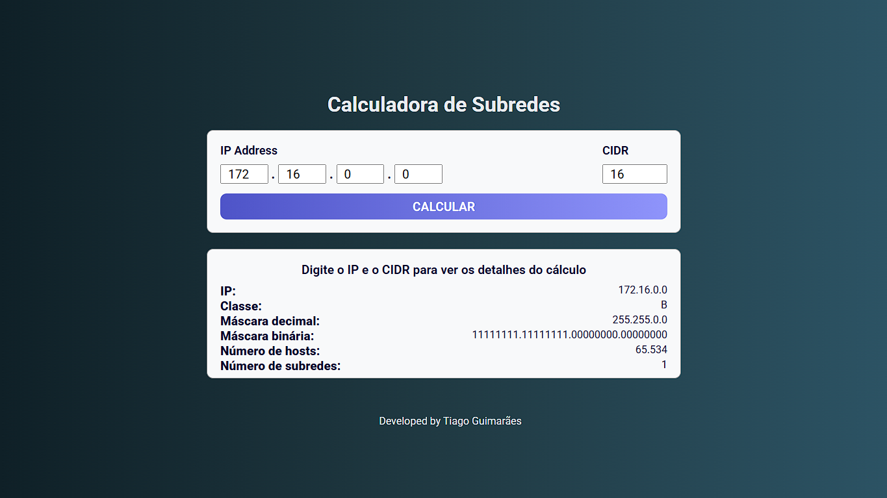

# Calculadora de Subredes

Pequeno projeto de uma calculadora de subredes para o curso de Desenvolvimento de Sistemas da escola Senai Jandira.

Neste projeto foram utilizados:

- **HTML**
- **CSS**
- **JavaScript**

Acesse a calculadora online aqui:

> https://tabguimaraes.github.io/iot-calculo-ip/

# Licença de Uso

Este projeto é totalmente livre.

O conhecimento deve ser acessível a todos, e é com essa filosofia que este trabalho foi criado.

Você pode usar, modificar, distribuir e compartilhar como quiser, sem restrições.

Não há garantias, nem responsabilidades atribuídas ao autor.

Que este projeto possa servir como base para algo ainda maior. ✨

Faça bom uso, crie coisas incríveis e, se quiser, compartilhe de volta com o mundo 🌍💛
